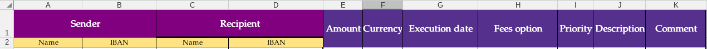

Orness IBanFirst SDK
====================
Orness SDK allow client to process batch payments with ibanfirst.
Assume you want to pay a list of suppliers at different time from different client wallet you own, the 
most simply way to do this is to fill an excel file with all information about the transaction you want to do and uppload it so that ornessSDK will 
parse the excel and send payments request to ibanfirst. 


## requirement
```sh
poetry
java >= 11 
python3

```

To generate the swagger client we need java installed.

### setup ornessSDK

```bash

#! /usr/bin/bash


function install {
    SWAGGER_YAML="../swagger.yaml"
    CODEGEN_JAR="swagger-codegen-cli.jar"
    CODEGEN_URL="https://repo1.maven.org/maven2/io/swagger/codegen/v3/swagger-codegen-cli/3.0.66/swagger-codegen-cli-3.0.66.jar"
    mkdir src
    cd src
    echo "Download swagger codegen jar" 
    wget "$CODEGEN_URL"  -O "$CODEGEN_JAR"
    echo "Download the ClientAPI swagger "
    

    echo "Generate ibanfirst client api"
    java -jar "$CODEGEN_JAR" generate -i  "$SWAGGER_YAML" -l python
    echo "change swagger-client to ibanfirst_client in entire project"
    mv swagger_client ibanfirst_client
    sed -i 's/swagger_client/ibanfirst_client/g' ibanfirst_client/*.py
    sed -i 's/swagger_client/ibanfirst_client/g' ibanfirst_client/*/*.py
    sed -i 's/swagger_client/ibanfirst_client/g' test/*.py
    cd ..
    
    
}

#-------------------------------------------------

install
poetry --version
poetry lock --no-interaction
poetry install --no-interaction
poetry build
poetry env activate
#-------------------------------------------------


```
run 

```sh
source install.sh 

```
## Version
For more [information](https://python-poetry.org/docs/cli/#version)

```bash
poetry version minor

```

## Authentication

username and password are provided by IBanFirst

```python
from orness.ornessSDK import OrnessSDK

sdk = OrnessSDK()
sdk.login(username="user",password="password", host="https://api.ibanfirst.com")
```

## Bulk Payments

```python
file = "new_payments_v2.xlsx"
sdk.post_payment(file) # return list of payments with status (awaintingconfirmation, planified) and ERRORs [list of payments, list of errors]
```


## Excel File
the template of the excel file is : 



## TEST
We make a POC with flask to test how to use the SDK

```sh
poetry add flask
poetry run python myflask/app.py
```


 

